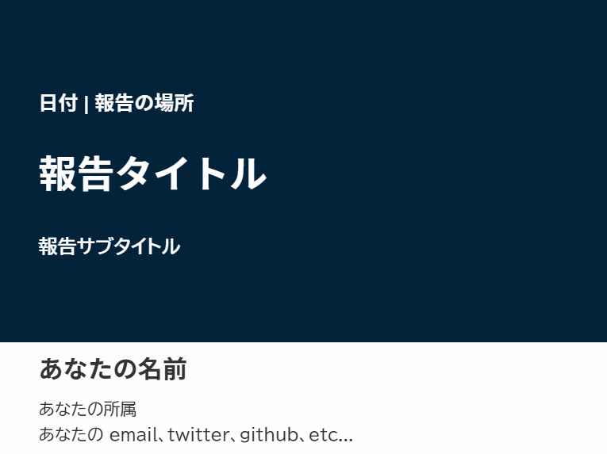
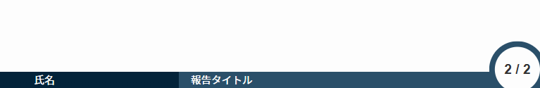
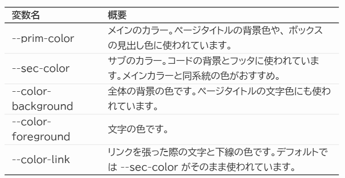
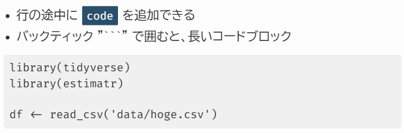
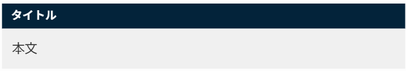

# Rojina: Marp Theme
"Rojina" は、特に政治学系の学術報告スライドのために作成されたカスタムテーマです。デザインと機能の両方でモダンでプロフェッショナルなテーマを目指しています。

## Marp
このテーマは、Marp 向けに作られています。Marp の使い方などは[公式ドキュメント](https://marp.app/)などを参照してください。

## Rojina テーマの導入方法

Marp for VS Code または Marp CLI のいずれかの環境が前提です。後者を使う人には説明は不要でしょうから、下記は VS Code で使う人向けの手順です。

#### 1. CSS ファイルを配置する
- `marp-theme/rojina.css` をダウンロードし、適当な場所に配置します。
  - おすすめは、作業ディレクトリに `marp-theme` というディレクトリを作成することです。
  - Settings > Marp: Themes にパスを記入します。
- または、Settings > Marp: Themes に次のように入力します。
  - `https://raw.githubusercontent.com/stats1230/rojina-theme-marp/refs/heads/main/rojina.css`

後者の方法はPCの環境に影響しないのでスッキリしますが、私がテーマを編集したりレポジトリを消したりすると、その影響を受けてしまいます。

#### 2. Yaml ヘッダの指定
- sample.md を参考に、Markdown ファイル (`.md`) を作成します。
- Markdown ファイルの先頭にある yaml ヘッダに、次のように記述します。

```yaml
---
marp: true
theme: rojina
paginate: true
lang: ja
footer: '<div>氏名</div><div>報告タイトル</div>'
style: |
  section {  
    --prim-color: #03233aff;      /* プライマリカラー */
    --sec-color: #2a4f69ff;       /* セカンダリカラー */
    --color-background: #fdfdfd;  /* 背景の色 */
    --color-foreground: #333;     /* 文字の色 */
    --color-link: var(--sec-color); /* リンクの色 */
    }
---
```

- それ以降は、通常の marp の方法に従ってファイルに記入していきます
- このテーマの独自の機能などについては、sample.md 及び後述の「Rojina の使い方」をご覧ください。


#### 3. PDF への出力
- コマンドパレット (VS Code の画面上部) から `Export Slide Deck` を選択します
  - PDF への出力は Chrome系のブラウザが必要になります。

## Rojina の使い方
ここからは、Rojina テーマに実装したいくつかの機能をまとめます。

### カラーパレットを自由に変更可能！
- Rojina テーマは、**css を書き換えることなく**テーマカラーを変更できます！
- 冒頭の yaml ヘッダのうち、style 以降にあるカラーコードを書き換えるだけで、自由に色を選択できます。

| 変数名 | 概要 |
| :--- | :--- |
| --prim-color | メインのカラー。ページタイトルの背景色や、 ボックスの見出し色に使われています。|
| --sec-color | サブのカラー。コードの背景とフッタに使われています。メインカラーと同系統の色がおすすめ。 |
| --color-background | 全体の背景の色です。ページタイトルの文字色にも使われています。 |
| --color-foreground | 文字の色です。 |
| --color-link | リンクを張った際の文字と下線の色です。デフォルトでは --sec-color がそのまま使われています。 |


- 色に困ったときは、"color palette two colors" とかで検索すると幸せになれます。
- メインとサブのカラーは同系統の色が、背景色とは補色系の色がよいです。

### タイトルページ
- タイトルページは、次のように書きます。
- タイトル/サブタイトルは `<br>` で改行ができます
```{md}
<!--
_class: title-page
_paginate: false
_footer: ''
-->

### 日付 | 報告の場所
# 報告タイトル
## 報告サブタイトル


<div class="author-block" markdown="1">

### あなたの名前
あなたの所属
あなたの email、twitter、github、etc...

</div>
```



### フッタを表示する
- 各ページのディレクティブ (`<!-- -->` で囲まれている部分) に `_footnote: ''` と書かなければ、フッタが表示されます。
- フッタの内容は、yaml ヘッダの `footer: '<div>氏名</div><div>報告タイトル</div>'` で指定できます


- ちなみにページ番号の部分は `_pageniate: false` と書けば消えます

### ヘッダを表示する
- 各ページのディレクティブに `<!--_header: 'hogehoge' -->` と書くと、ヘッダが表示されます。
- セクションタイトルなど情報の少ないものを書くことを想定して、文字をかなり小さくしています。
- 太字 (2つの`**`で囲む) は濃く、それ以外は不透明度が下がります。
- CSS のちからでは、自動的なナビゲーションは実装できません。無念。


### ページのタイトル
- 見出し2 (`##`) がページのタイトルになります
- 1ページに見出し2を2つ入れることも技術的には可能ですが……おすすめしません


### 表を挿入する
- 一般的な markdown 記法に従い表を挿入できます。
- 見出し (header) 部分の上下と、表の一番下に線が引かれます。
- 表全体を`<div class="table-container">` と `</div>` で囲むと7割くらいの大きさになります。



### コードブロックを挿入する
- インライン (文中) コードは、2つの "`" (バッククォート) で囲むことで、背景と文字がそれっぽくなります
- 2つの "```" で囲まれた部分は、大きなコードブロックになります。



### 見出し付きのブロックを挿入する
- 以下のようなコードを書くことで、見出し付きのブロックを挿入できます。

```
<div class="block">
  <div class="block-title">タイトル</div>
  <div class="block-content">本文</div>
</div>
```




- ブロック内でもマークダウン記法が有効です。
  - もちろん、$\TeX$ 記法で数式を含めることもできます。

### 参考文献のページを作る
- ディレクティブに `_class: ref` と書くことで、参考文献のページを作ることができます
- 参考文献のページは、セリフ体で文字を小さめにしています。
- 通常の論文のように、ぶら下げインデントを再現しています。